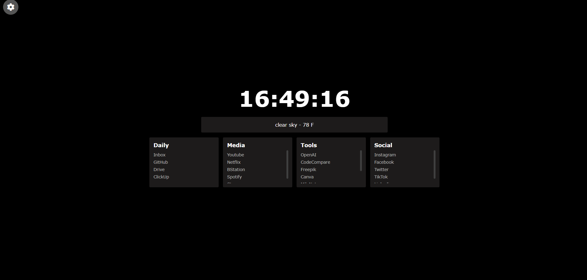
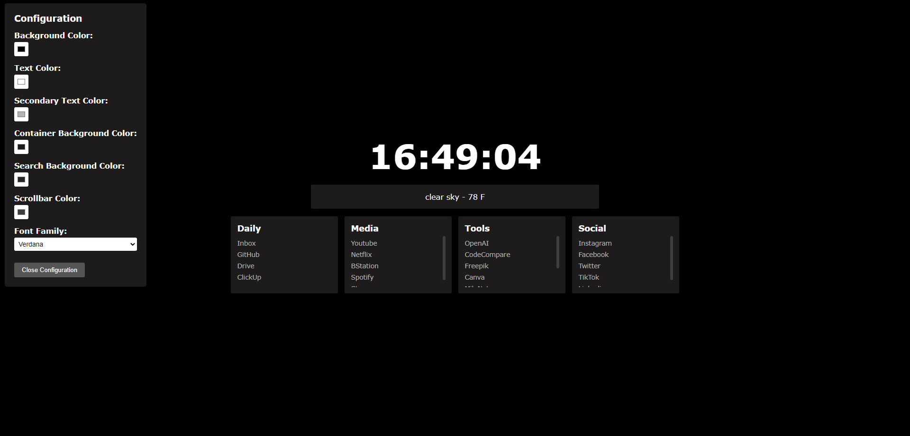

# Homepage

## Customization

### Customize Bookmarks

Bookmarks are now held in the `bookmarks.js` file for easy updating. `bookmarks` is an array of objects with a `title` and `links` property. The `title` defines what the header of the "bookmark section" box will be. `link` is an array of link objects each with a name and a url to link to.

> The way the site is currently styled bookmarks should always have a length of `4` if you want to have more sections you need to change the `width` property of the css class `bookmark-set`

### Customize Search Engine

To use Search Engine (Default : Google) press "Space"

You can change the search engine used by the search overlay by updating the url value stored in the `searchUrl` var in `index.html` to the correct string for your engine.

Examples:

- DuckDuckGo: `https://duckduckgo.com/?q=`
- Bing: `https://www.bing.com/search?q=`

